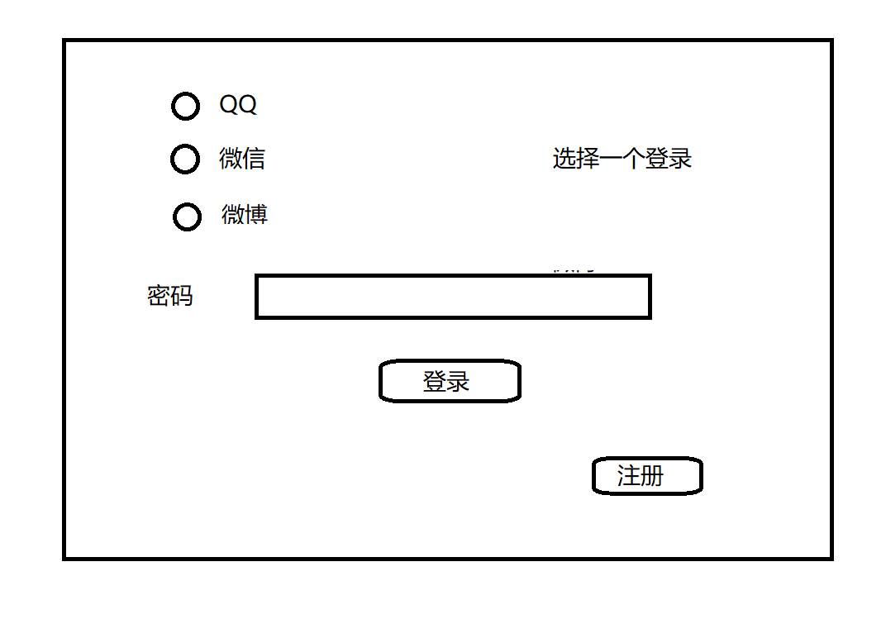
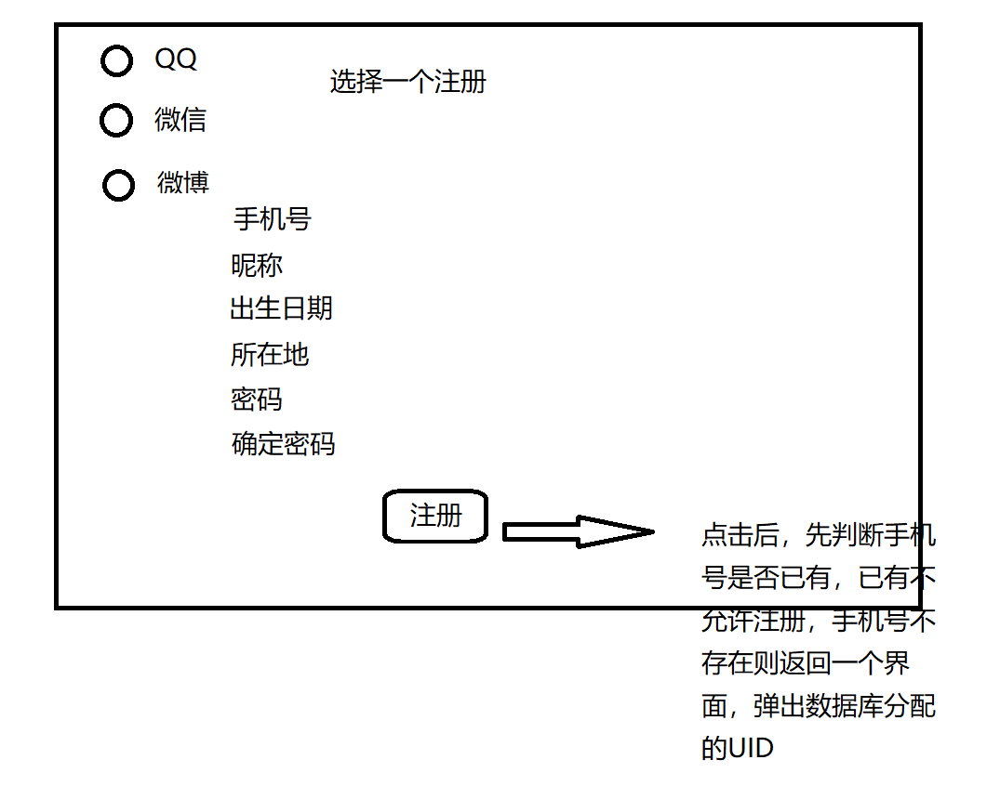
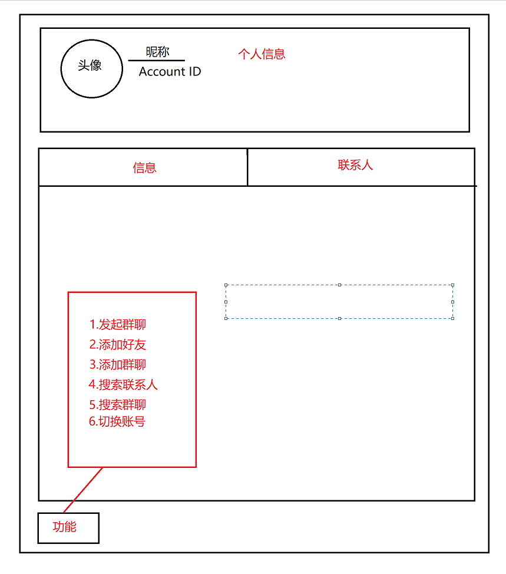

# 界面设计

QQ和微信主要实现聊天功能(在加入群聊、可否群管理等方面有所不同)，微博主要实现发微博功能(广播)

### 1.welcomePageLzy

实现模块：

登录或注册，登录后该用户开通的所有服务均处于”在线”状态(跳转MainMenuPageLzy)

### 2.RegisterPageLzy

### 2.MainPageLzy

实现模块：

显示个人信息(点击跳转UserInfoPageLzy)，显示好友和群聊消息(点击跳转ChatPageLzy)，显示已有好友和群聊(点击跳转ChatPageLzy)、实现功能界面跳转(点击控件跳转FriendManagePageLzy或GroupManagePageLzy)

### 3.FriendManagePageLzy

实现模块：

添加好友(点击跳转SearchInfoPage)、删除好友、查询好友、查看共同好友、处理好友申请

### 4.GroupManagePageLzy

实现模块：

创建群聊、添加群聊(QQ允许，微信不允许)、退出群聊

### 5.GroupMemberPageLzy

实现模块：

通过群聊加好友(跳转UserInfoPageLzy)、拉好友入群、踢人(QQ群主和管理员、微信群主)

### 6.UserInfoPageLzy

### 7.ChatPageLzy

